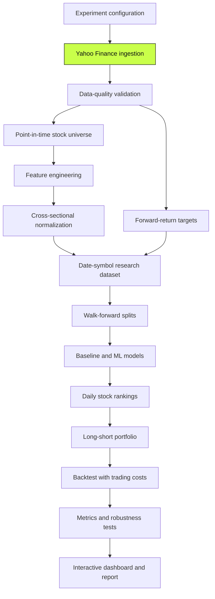

# Relative Edge

Cross-sectional ML pipeline for ranking stocks and backtesting factor-based
long-short strategies.

> **Project status:** early research scaffold. Yahoo Finance ingestion is
> implemented and tested. Feature engineering, modeling, backtesting, and the
> dashboard are planned but intentionally empty.

## The idea

Suppose the market falls by 6% during a difficult week:

| Stock | Weekly return |
|---|---:|
| Microsoft | −2% |
| Apple | −3% |
| Market | −6% |
| Company C | −11% |

An absolute prediction that Apple would rise was wrong. A relative prediction
that ranked Microsoft and Apple above Company C could still have been useful.

Relative Edge is built around that distinction. Instead of asking:

> Will one stock go up tomorrow?

the project asks:

> Which stocks are likely to outperform or underperform the rest of the
> universe over the next several trading days?

The planned model converts historical price and volume data into factors such
as momentum, reversal, volatility, and unusual volume. It then compares those
factors across stocks on the same date, predicts a relative ranking, and tests
the ranking through a realistic long-short backtest.

This is a research and learning project, not a trading recommendation or a
claim of guaranteed returns.

## Why build it?

A stock-ranking project brings several subjects together in one system:

- **Probability and statistics:** returns, distributions, variance,
  correlation, hypothesis tests, confidence intervals, and uncertainty.
- **Machine learning:** feature design, regularization, model comparison,
  chronological validation, and overfitting control.
- **Calculus and optimization:** loss functions, gradients, least squares, and
  the effect of regularization.
- **Algorithms:** rolling calculations, grouping, ranking, sorting, and
  processing large date-symbol datasets efficiently.
- **Quantitative finance:** market-relative performance, portfolio exposure,
  transaction costs, turnover, drawdown, and risk-adjusted returns.
- **Software engineering:** modular stages, reproducible experiments, tests,
  explicit failure handling, and separation of research from presentation.
- **Data visualization:** charts that explain whether a signal works, when it
  fails, and how much of the apparent result survives realistic assumptions.

Markets are a useful environment for learning because weak experimental design
is punished quickly. A beautiful equity curve can be created accidentally by
future-data leakage, survivorship bias, repeated model selection, or ignored
trading costs. The objective is therefore not merely to obtain a profitable
backtest. The objective is to construct a reproducible argument that can be
inspected and challenged.

For the long-form visual explanation, open
[the interactive motivation page](docs/motivation.html) after cloning the
repository.

## Research question

The main hypothesis is:

> Information contained in recent prices, volatility, and trading volume can
> help rank the future relative performance of stocks better than a naive
> baseline.

The project should answer several narrower questions:

1. Do individual factors have a stable relationship with future return ranks?
2. Does combining factors improve ranking quality out of sample?
3. Does the relationship persist across different years and market regimes?
4. Do higher prediction groups outperform lower prediction groups
   monotonically?
5. Does a long-short portfolio remain viable after turnover and transaction
   costs?
6. Is a more complex model actually better than a simple linear baseline?

## Planned research pipeline



Only the green ingestion stage is implemented. The remaining boxes describe
the intended direction of the repository.

## Current functionality

The implemented `YahooFinanceDataLoader`:

- Downloads daily OHLCV data through `yfinance`.
- Accepts one or multiple stock symbols.
- Accepts dates as strings or `datetime.date` values.
- Normalizes symbols to uppercase.
- Removes duplicate symbol requests while preserving order.
- Validates that at least one non-empty ticker was supplied.
- Validates that the start date precedes the end date.
- Uses an explicit configurable network timeout.
- Requests unadjusted OHLC prices and adjusted close separately.
- Converts Yahoo's wide, multi-level response into long format.
- Sorts the result by date and symbol.
- Raises a project-specific error for empty or malformed responses.

Yahoo Finance treats the supplied `end_date` as exclusive. For example,
`end_date="2025-01-10"` requests observations strictly before January 10.

### Example

```python
from factor_model.data import YahooFinanceDataLoader


loader = YahooFinanceDataLoader(timeout_seconds=30)

prices = loader.load(
  symbols=["AAPL", "MSFT", "JPM"],
  start_date="2020-01-01",
  end_date="2025-01-01",
)

print(prices.head())
```

The returned `pandas.DataFrame` contains one row per trading date and symbol:

| Column | Meaning |
|---|---|
| `date` | Trading date returned by Yahoo Finance |
| `symbol` | Normalized stock ticker |
| `open` | Unadjusted opening price |
| `high` | Unadjusted daily high |
| `low` | Unadjusted daily low |
| `close` | Unadjusted closing price |
| `adjusted_close` | Closing price adjusted for corporate actions |
| `volume` | Reported trading volume |

Example shape:

```text
        date symbol    open    high     low   close  adjusted_close     volume
0 2024-01-02   AAPL  187.15  188.44  183.89  185.64          ...          ...
1 2024-01-02    JPM  169.09  172.17  168.43  172.08          ...          ...
2 2024-01-02   MSFT  373.86  375.90  366.77  370.87          ...          ...
```

Values above are illustrative; live Yahoo Finance responses can change.

## Planned functionality

### 1. Data validation and storage

- Detect missing dates, duplicate rows, and incomplete symbol histories.
- Validate positive prices and consistent high/low relationships.
- Distinguish missing observations from legitimate zero volume.
- Cache unchanged raw downloads under `data/raw/`.
- Store cleaned, reproducible datasets under `data/processed/`.
- Produce a coverage report for each symbol and date range.
- Record provider, retrieval time, universe, and processing configuration.

### 2. Universe construction

- Begin with a fixed, manually reviewed stock universe.
- Require sufficient price history for every selected feature.
- Apply minimum price and liquidity requirements.
- Avoid using future information when determining eligibility.
- Document the survivorship bias present in the first version.
- Later support historical point-in-time index membership.

### 3. Feature engineering

Initial factor candidates include:

- 5-, 20-, 60-, and 120-day momentum.
- Long-term momentum excluding the most recent month.
- 1-, 3-, and 5-day short-term reversal.
- Price distance from moving averages.
- 20- and 60-day realized volatility.
- Average True Range relative to price.
- Downside volatility and drawdown from a recent high.
- Current volume relative to rolling average volume.
- Volume z-score and rolling dollar liquidity.
- Market beta and market-relative residual return.

All features must be computable from information available at prediction time.

### 4. Cross-sectional preprocessing

For every date, each feature will be compared across the eligible stocks on
that date. Planned transformations include:

- Cross-sectional z-scores.
- Percentile and ordinal ranks.
- Outlier clipping or winsorization.
- Missing-value rules fitted on training data only.
- Feature correlation and redundancy checks.
- Optional sector and market-exposure neutralization.

This is the defining difference between the project and a single-stock
time-series forecast. A momentum value describes not only how a stock moved,
but how strongly it moved relative to its peers.

### 5. Target generation

- Calculate 1-, 5-, and 20-day forward returns.
- Convert forward returns into cross-sectional ranks or percentiles.
- Optionally remove broad-market and sector returns.
- Keep target calculations isolated from feature calculations.
- Account for overlapping prediction horizons during validation.

For a prediction made after trading on Monday, Monday's features may only use
information available by that time. Prices from Tuesday onward belong to the
target and must never enter the feature table.

### 6. Walk-forward validation

Random train/test splitting is not appropriate for this project because it can
train on the future and test on the past. The intended evaluation expands
through time:

```text
Iteration 1: train 2018–2020 | validate 2021 | test 2022
Iteration 2: train 2018–2021 | validate 2022 | test 2023
Iteration 3: train 2018–2022 | validate 2023 | test 2024
```

The final evaluation should include:

- Expanding and rolling training windows.
- An embargo gap when forward-return labels overlap.
- Hyperparameter selection using validation periods only.
- A final untouched test period.
- Reproducible split definitions saved with each experiment.

### 7. Modeling

Models will be added in increasing order of complexity:

1. Random-ranking and equal-weight baselines.
2. Hand-written weighted factor score.
3. Ordinary linear regression.
4. Ridge regression.
5. Lasso or Elastic Net.
6. Tree ensembles or gradient boosting, if linear baselines justify it.

The goal is not to use the most advanced model. It is to determine whether
additional complexity produces stable out-of-sample improvement. Linear models
are especially useful because their coefficients can reveal the direction and
stability of each factor relationship.

### 8. Portfolio construction

The first portfolio design will:

- Rank all eligible stocks by predicted score.
- Buy the top prediction group.
- Short the bottom prediction group.
- Begin with equal weights within each side.
- Balance long and short dollar exposure.
- Limit individual position size.
- Rebalance on a configurable daily or weekly schedule.
- Track gross exposure, net exposure, turnover, and concentration.

Later versions may add volatility scaling, sector neutrality, beta neutrality,
and liquidity-aware position limits. A portfolio is not automatically
market-neutral simply because it contains both long and short positions.

### 9. Backtesting

- Apply positions only after their underlying data becomes available.
- Lag signals and trades correctly.
- Calculate long-side and short-side returns separately.
- Track entries, exits, and portfolio turnover.
- Deduct configurable commissions and slippage.
- Handle missing prices and unavailable positions explicitly.
- Compare against simple factor and market baselines.
- Store daily positions, returns, and cost attribution.

### 10. Evaluation

#### Predictive metrics

- Daily Spearman Information Coefficient (IC).
- Mean and median IC.
- Rolling IC.
- IC information ratio.
- Percentage of periods with positive IC.
- Quintile or decile return separation.
- Monotonicity across prediction groups.

#### Portfolio metrics

- Cumulative and annualized return.
- Annualized volatility.
- Sharpe ratio.
- Maximum drawdown and drawdown duration.
- Hit rate.
- Turnover and total transaction cost.
- Long and short contribution.
- Exposure and concentration.

#### Robustness checks

- Performance by calendar year.
- Performance by sector.
- High- and low-volatility market regimes.
- Bull and bear periods.
- Different target horizons.
- Different rebalance frequencies.
- Different portfolio sizes.
- Transaction-cost sensitivity.

### 11. Visualization

The planned Streamlit dashboard will include:

- Data coverage and missing-value views.
- Normalized stock-price comparisons.
- Factor distributions and outlier diagnostics.
- Feature correlation heatmaps.
- Factor quintile and decile charts.
- Prediction-group cumulative-return curves.
- Daily and rolling IC.
- Portfolio equity and drawdown curves.
- Rolling volatility and Sharpe ratio.
- Turnover and transaction-cost attribution.
- Cost-sensitivity analysis.
- Model coefficients and feature importance.
- Performance broken down by year, sector, and market regime.
- Downloadable experiment configuration and results.

## Project structure

```text
relative-edge/
├── dashboard/
│   └── app.py                 # Planned Streamlit dashboard
├── data/
│   ├── raw/                   # Downloaded source data; ignored by Git
│   └── processed/             # Features, targets, and experiment datasets
├── docs/
│   ├── architecture.md        # Planned architecture documentation
│   └── motivation.html        # Interactive project explanation
├── notebooks/
│   └── README.md              # Planned exploratory notebook index
├── src/
│   └── factor_model/
│       ├── data.py            # Yahoo Finance ingestion — implemented
│       ├── features.py        # Planned factor calculations
│       ├── targets.py         # Planned forward-return targets
│       ├── models.py          # Planned model adapters
│       ├── portfolio.py       # Planned portfolio construction
│       ├── backtest.py        # Planned simulation and trading costs
│       ├── metrics.py         # Planned evaluation metrics
│       ├── pipeline.py        # Planned experiment orchestration
│       └── config.py          # Planned experiment configuration
├── tests/
│   └── test_data.py           # Data-loader unit tests
├── pyproject.toml
└── README.md
```

Empty modules are intentional placeholders. They define the intended project
outline without pretending later stages have already been implemented.

## Technology

| Technology | Planned responsibility |
|---|---|
| Python | Pipeline implementation and experiment orchestration |
| yfinance | Educational access to historical Yahoo Finance data |
| pandas | Date-symbol tables, rolling calculations, grouping, and joins |
| NumPy | Vectorized numerical calculations and portfolio simulation |
| scikit-learn | Linear models, preprocessing, and model evaluation |
| Seaborn | Exploratory statistical visualization |
| Streamlit | Interactive results dashboard |
| unittest | Deterministic unit tests without an additional test framework |
| uv | Environment and dependency locking |
| Git | Versioning code, assumptions, and research changes |

Only `yfinance` and `pandas` are currently used by implemented application
code. The remaining dependencies support later roadmap stages.

## Installation

Relative Edge requires Python 3.12 or newer.

### Using uv

```bash
git clone <repository-url>
cd relative-edge
uv sync
```

Run Python through the synchronized environment:

```bash
uv run python
```

### Using pip

```bash
git clone <repository-url>
cd relative-edge
python -m venv .venv
```

Activate the environment on Windows PowerShell:

```powershell
.venv\Scripts\Activate.ps1
```

Or on Linux and macOS:

```bash
source .venv/bin/activate
```

Then install the project:

```bash
python -m pip install -e .
```

## Running the tests

The data-loader tests mock Yahoo Finance, so they do not require a network
connection and do not depend on current market data.

With `uv`:

```bash
PYTHONPATH=src uv run python -m unittest discover -s tests -v
```

Windows PowerShell:

```powershell
$env:PYTHONPATH = "src"
uv run python -m unittest discover -s tests -v
```

The current test suite checks:

- Multi-symbol conversion into long format.
- Symbol normalization and duplicate removal.
- Empty Yahoo Finance responses.
- Empty symbol lists.
- Reversed date ranges.

## Research principles

1. **Chronology before convenience.** Never use a random split when it allows
   the future to influence the past.
2. **Simple before complex.** A sophisticated model must beat a transparent
   baseline out of sample.
3. **Costs before conclusions.** Turnover, slippage, and commissions belong in
   the main result.
4. **Ranks before dramatic forecasts.** Small, stable relative information is
   more credible than exact price predictions.
5. **Failures remain visible.** Weak years and bad regimes should be shown, not
   averaged away.
6. **Reproducibility is part of the result.** Data definitions, parameters,
   splits, and assumptions must be saved.
7. **Plots answer questions.** Every visualization should test or explain a
   specific part of the research claim.

## Known limitations

- `yfinance` is convenient for education and prototyping, but it is not a
  production-grade market-data service and may change or omit observations.
- The initial universe will likely use stocks that exist today, introducing
  survivorship bias into historical experiments.
- Daily data cannot represent intraday execution or detailed market impact.
- Short selling involves borrow availability and costs that are difficult to
  model accurately with free data.
- Historical relationships may disappear when market behavior changes.
- Testing many factors and configurations increases the risk of discovering a
  result that occurred by chance.
- A backtest is evidence about historical simulation, not proof of future
  profitability.

## Roadmap

- [x] Define the repository structure.
- [x] Implement Yahoo Finance OHLCV ingestion.
- [x] Normalize multi-symbol responses into long format.
- [x] Add deterministic data-loader tests.
- [x] Create the interactive project motivation page.
- [ ] Add data-quality validation and local caching.
- [ ] Define a reproducible starter universe.
- [ ] Implement initial momentum, reversal, volatility, and volume factors.
- [ ] Add cross-sectional normalization.
- [ ] Generate ranked forward-return targets.
- [ ] Implement walk-forward dataset splits.
- [ ] Add naive and linear baselines.
- [ ] Implement portfolio construction and transaction costs.
- [ ] Add predictive and portfolio evaluation metrics.
- [ ] Build the Streamlit dashboard.
- [ ] Write the final research report with limitations and robustness tests.

## Disclaimer

This repository is for education and research. It does not provide investment
advice, and its outputs should not be used as the sole basis for financial
decisions. Historical performance, including simulated performance, does not
guarantee future results.
