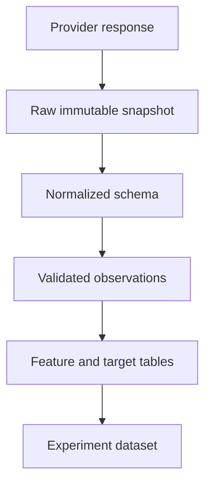

# Market Data Preparation

## Concrete example: the price dropped, but shareholders did not lose 50%

A stock closes at 100. The company performs a two-for-one split. The next raw
close may be near 50, but each shareholder now owns twice as many shares. A naive
return calculation reports approximately −50%, even though no corresponding
economic loss occurred.

This is why data preparation is not cleaning around the real research. It is part
of the model definition.

## 1. Define the observation contract

For daily equity bars, a useful internal contract is:

| Field | Type | Meaning | Example checks |
|---|---|---|---|
| `date` | date/datetime | Trading session label | parseable, non-null |
| `symbol` | string | Provider-normalized identifier | non-empty |
| `open` | float | First regular-session trade/bucket value | positive |
| `high` | float | Maximum price | `high >= open, close, low` |
| `low` | float | Minimum price | `low <= open, close, high` |
| `close` | float | Final price | positive |
| `adjusted_close` | float | Close adjusted for corporate actions | positive |
| `volume` | number | Traded units reported by provider | non-negative |

The pair `(date, symbol)` should normally be unique.

```python
keys = prices[["date", "symbol"]]
if keys.duplicated().any():
  raise ValueError("duplicate date-symbol observations")
```

## 2. Raw, adjusted, and total-return data

### Raw close

Raw close is the observed historical share price. Splits change its scale.

### Adjusted close

Adjusted close attempts to create a comparable historical series after corporate
actions. Provider methodology matters: some series adjust for splits only;
others incorporate dividends as well.

### Total return

A total-return series explicitly represents price appreciation plus reinvested
distributions. It is the appropriate conceptual object when evaluating the
wealth of an investor who receives dividends.

Never mix raw and adjusted values inside one return formula without a documented
reason. Inspect a known split and dividend before trusting a provider's columns.

## 3. Arithmetic and log returns

Arithmetic simple return:

$$
r_t = \frac{P_t}{P_{t-1}} - 1
$$

Log return:

$$
\ell_t = \log(P_t) - \log(P_{t-1})
$$

Simple returns combine naturally into portfolio returns for one period. Log
returns add across time. For small moves they are close, but they are not
interchangeable.

```python
prices["return_1d"] = (
  prices.groupby("symbol")["adjusted_close"].pct_change()
)
```

The first observation for every symbol should be missing because no previous
price exists. Filling it with zero invents evidence.

## 4. Missing observations

Missingness has several possible meanings:

- The exchange was closed for everyone.
- One stock was suspended.
- The symbol did not exist yet.
- The security was delisted.
- The provider failed to return a row.
- Two assets trade on different calendars.

These cases should not share one automatic fill rule.

Forward-filling a stale price can be reasonable for portfolio valuation under a
specific convention, but dangerous for feature construction. It may create fake
zero returns and understate volatility. Keep an availability flag and document
the rule at each stage.

## 5. Calendars, timestamps, and timezones

Daily bars often use a session date rather than an exact tradable instant. Ask:

- Which exchange calendar defines the session?
- When is the closing value known?
- Is an adjusted value revised later?
- At what timestamp may a strategy trade on it?
- Are all assets aligned to the same timezone and session?

If a signal uses today's official close, a conservative daily simulation trades
at the next session rather than assuming it traded at the already-known close.

## 6. Universe construction

The universe determines which assets could have been selected.

### Survivorship bias

Using today's index members throughout ten years of history removes firms that
failed, merged, or left the index. The survivors are systematically different
from the historical population.

### Point-in-time membership

The ideal universe records which symbols were eligible on each date. If that
data is unavailable, use a fixed current universe only as an educational
simplification and state the bias prominently.

### Eligibility rules

Rules might require:

- At least 252 previous valid sessions.
- Price above a minimum threshold.
- Rolling median dollar volume above a threshold.
- Availability of every required feature.
- No use of future liquidity or future index membership.

The rules themselves can create selection bias. They must be computed at the
decision date.

## 7. Outliers and suspicious values

Do not remove an extreme return merely because it is inconvenient. First decide
whether it is:

1. A real market move.
2. A corporate action.
3. A currency/unit error.
4. A stale or bad quote.
5. A symbol mapping error.

Useful diagnostics:

```python
summary = (
  prices.groupby("symbol")
  .agg(
    first_date=("date", "min"),
    last_date=("date", "max"),
    rows=("date", "size"),
    missing_close=("adjusted_close", lambda x: x.isna().sum()),
  )
)
```

Flagging is often safer than deleting. Preserve raw data so every cleaning choice
can be reproduced.

## 8. Long-format research tables

A robust research table uses one row per `(date, symbol)` and columns for:

- Identifiers.
- Known raw/clean values.
- Features.
- Eligibility flags.
- Targets.
- Split labels.

Do not overwrite raw columns with features or targets. Traceability matters when
a suspicious result appears months later.

## 9. Data layers



Suggested responsibilities:

- **Raw:** unchanged provider output plus retrieval metadata.
- **Normalized:** stable names, types, timezone, and shape.
- **Validated:** quality checks and explicit exclusions.
- **Derived:** factors, targets, and eligibility.
- **Experiment:** exact columns and rows used for one model run.

## 10. Leakage checks during preparation

Common leakage routes include:

- Backfilling a missing value using a later observation.
- Normalizing the entire dataset with one future-aware mean and standard
  deviation.
- Selecting a universe using future volume or survival.
- Using a revised fundamental statement before its publication date.
- Centering a rolling window so it includes future rows.
- Joining data by period label instead of actual availability timestamp.

Write the prediction timestamp next to every dataset. “Annual revenue for 2024”
does not mean the value was known on December 31, 2024.

## Practical checklist

- [ ] `(date, symbol)` is unique.
- [ ] Rows are sorted by symbol and date.
- [ ] Types and timezones are explicit.
- [ ] Raw and adjusted prices are not confused.
- [ ] Corporate actions have been spot-checked.
- [ ] Missing-data rules distinguish causes.
- [ ] Eligibility uses only contemporaneously available information.
- [ ] Raw inputs remain recoverable.
- [ ] Every cleaning step is deterministic and tested.
- [ ] Data coverage is reported before modeling.

## Practice

1. Construct a split example and compare raw-close and adjusted-close returns.
2. Create a missing row for one stock and show how forward fill changes its
   volatility.
3. Write a validator for unique keys and OHLC relationships.
4. Build a daily eligibility flag using only trailing dollar volume.
5. Explain which timestamp you would assign to a daily signal calculated from a
   closing price.

## Further reading

- [yfinance download parameters](https://ranaroussi.github.io/yfinance/reference/api/yfinance.download.html)
- [pandas missing-data guide](https://pandas.pydata.org/docs/user_guide/missing_data.html)
- [pandas time-series guide](https://pandas.pydata.org/docs/user_guide/timeseries.html)
