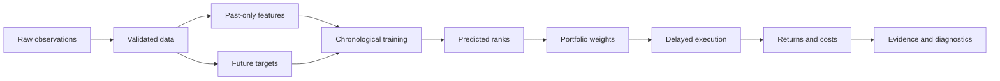

# Quantitative ML Foundations

This handbook explains the reusable pieces behind a cross-sectional quantitative
machine-learning system. It is not documentation for one repository. The goal is
to understand the concepts and tools well enough to design, criticize, and test
many research pipelines.

## Start with the mental model

On one date, imagine a table with one row per stock:

| date | symbol | momentum | volatility | volume shock | future return rank |
|---|---|---:|---:|---:|---:|
| 2025-01-02 | AAA | 0.73 | −0.31 | 1.10 | 0.84 |
| 2025-01-02 | BBB | −0.18 | 0.55 | −0.20 | 0.35 |
| 2025-01-02 | CCC | 1.25 | 1.40 | 0.82 | 0.61 |

The first three numerical columns describe information available on the date.
The last column describes what happened afterward. Machine learning estimates a
function from the known columns to the future rank. Portfolio construction then
turns predicted ranks into weights. Backtesting applies those weights to later
returns while respecting time and costs.

The central rule is simple:

> At every simulated decision, the system may use only information that would
> have been available at that moment.

Most serious mistakes in quantitative research are violations or disguises of
that rule.

## Learning path

1. [Python and the data stack](01_python_and_data_stack.md) — environments,
   NumPy, pandas, yfinance, shapes, indexes, and vectorization.
2. [Market data preparation](02_market_data_preparation.md) — data contracts,
   corporate actions, missing observations, universes, and point-in-time safety.
3. [Statistics and factor signals](03_statistics_and_factors.md) — returns,
   risk, cross-sectional normalization, momentum, reversal, and signal tests.
4. [Machine-learning models](04_machine_learning_models.md) — baselines, OLS,
   Ridge, Lasso, trees, boosting, losses, and interpretation.
5. [Time-aware validation](05_time_aware_validation.md) — walk-forward splits,
   overlapping labels, embargoes, tuning, and honest model comparison.
6. [Finance and portfolio construction](06_finance_and_portfolios.md) — long and
   short positions, weights, exposure, neutrality, turnover, and constraints.
7. [Backtesting correctly](07_backtesting.md) — event timing, PnL accounting,
   costs, biases, implementation patterns, and invariants.
8. [Metrics and visual evidence](08_metrics_and_visualization.md) — IC, Sharpe,
   drawdown, group returns, diagnostics, and how to read the charts.
9. [Dashboards and reproducibility](09_dashboard_and_reproducibility.md) —
   Streamlit, caching, configuration, testing, experiment records, Git, and uv.
10. [Mathematical foundations](10_mathematical_foundations.md) — vectors,
    matrices, gradients, probability, covariance, PCA, dependence, and numerical
    stability.
11. [Advanced factor engineering](11_advanced_factor_engineering.md) — robust
    transformations, neutralization, decay, composites, interactions, and factor
    testing.
12. [Practical model recipes](12_practical_model_recipes.md) — complete baseline,
    Ridge, Elastic Net, forest, and boosting workflows with model diagnostics.
13. [Inference and research risk](13_inference_and_research_risk.md) — dependent
    observations, block bootstrap, multiple testing, placebo tests, and research
    ledgers.
14. [Portfolio optimization and risk](14_portfolio_optimization_and_risk.md) —
    covariance shrinkage, constrained optimization, turnover penalties, risk
    parity, and factor risk models.
15. [End-to-end case study](15_end_to_end_case_study.md) — a complete path from
    a research contract through features, validation, modeling, backtesting,
    artifacts, and interpretation.
16. [Glossary](glossary.md) — concise definitions of the most important terms.

## How to study each chapter

Use three passes:

### Pass 1: explain it without code

After reading a section, explain the idea using a five-stock example. If the
explanation requires library names, you probably understand the API but not the
concept yet.

### Pass 2: calculate a tiny example by hand

Calculate one return, one z-score, one Ridge objective, one portfolio return,
and one transaction-cost deduction. Small examples expose sign and timing errors
that disappear inside large DataFrames.

### Pass 3: implement and test the invariant

Every stage has an invariant—a fact that should always be true:

| Stage | Example invariant |
|---|---|
| Raw data | One row per date and symbol |
| Features | No feature uses a later timestamp |
| Target | Last `horizon` observations per symbol have missing targets |
| Ranking | One score per eligible stock per decision date |
| Portfolio | Long and short weights satisfy the intended exposure |
| Backtest | Return at date `t` uses a position known before that return |
| Costs | Higher assumed costs cannot improve net performance |

Write tests for these properties before optimizing performance.

## What this handbook deliberately does not promise

- A factor that worked historically will not necessarily work later.
- A high backtest Sharpe ratio is not proof of skill.
- Cross-sectional long-short construction is not automatically market-neutral.
- Free daily data cannot model exact execution, short availability, or market
  impact.
- More complicated models are not automatically more suitable for noisy tabular
  financial data.

The purpose is to learn how to produce better evidence, not how to manufacture a
convincing chart.

## Reference conventions

- `t` means the decision date.
- `i` means an asset or stock.
- `r[i,t]` means the return of asset `i` associated with date `t`.
- `h` means a future prediction horizon.
- `X` is a feature matrix and `y` is a target vector.
- A basis point, written `bp`, is `0.01%`; 10 bps is `0.10%`.

Examples use daily observations for clarity. The same timing principles apply to
weekly, monthly, and intraday data.
